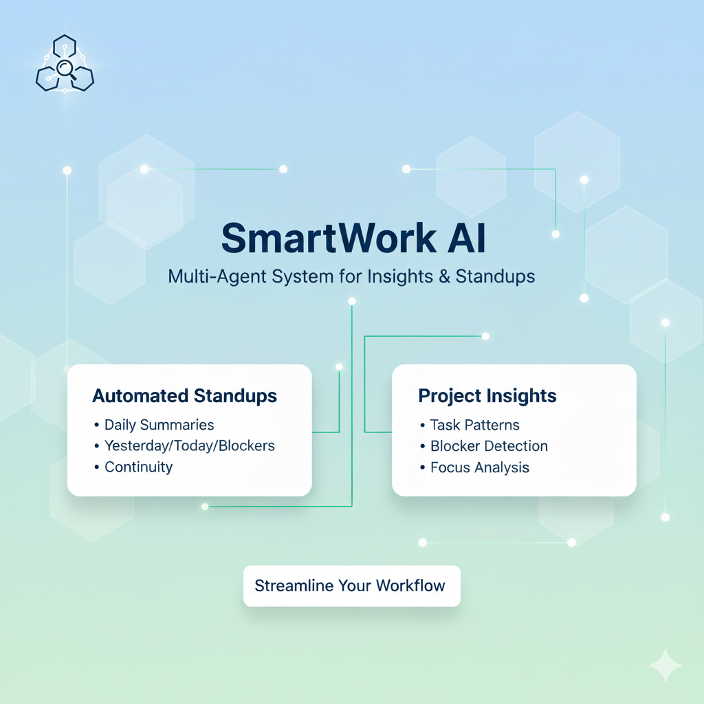
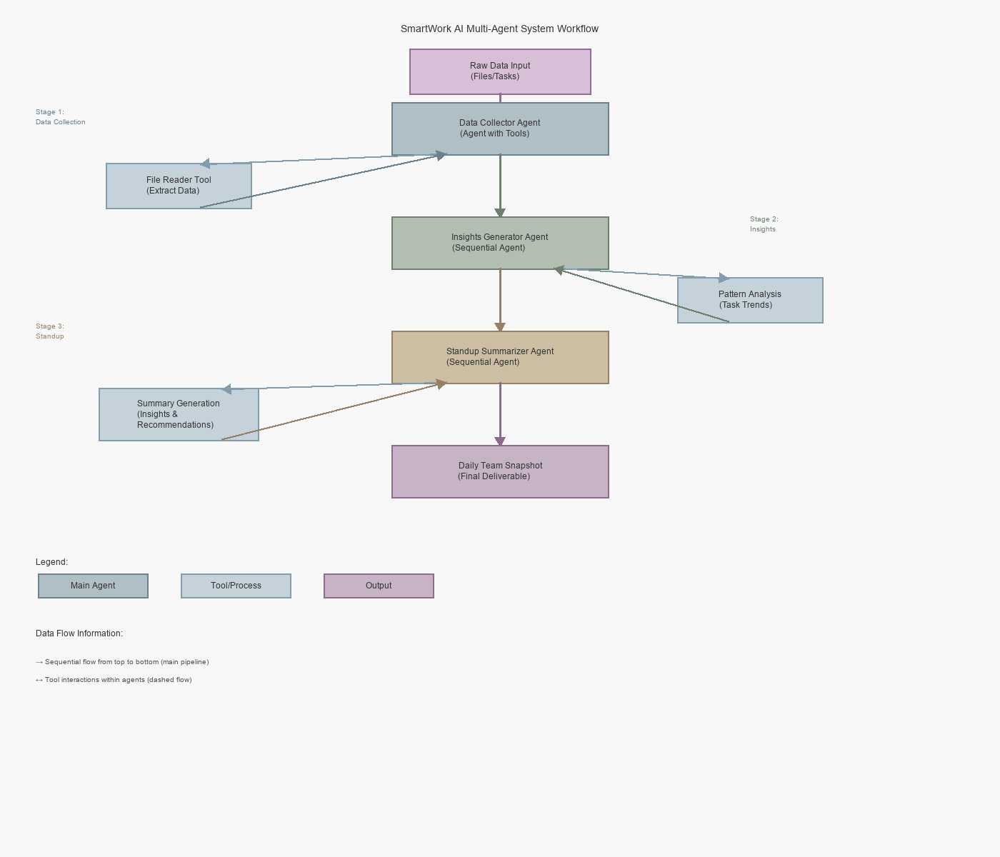

## Project Overview - SmartWork AI

SmartWork AI is a smart, multi-agent system that automatically gathers updates, analyzes team activity, and generates clear daily insights—eliminating the need for manual standups or scattered status reporting. Powered by LLM-driven agents, tools, long-running sessions, summarizes progress, detects blockers, and prepares ready-to-use reports for teams and managers. In just minutes, SmartWork AI turns messy, fragmented work signals into clean, actionable intelligence—boosting productivity, cutting communication overhead, and enabling teams to move faster with complete clarity.



### Problem Statement

Daily standups are time-consuming and often produce inconsistent or incomplete updates. Team leads spend a significant amount of time collecting information from chats, emails, trackers, and dashboards. The data is fragmented, poorly summarized, and sometimes inaccurate. Additionally, leaders need insights—not just raw updates—such as task trends, risks, blockers, or team focus patterns.

SmartWork AI solves this by creating a multi-agent pipeline that gathers fragmented information, summarizes it in human-friendly narratives, extracts insights, and generates a final “Daily Snapshot” for the team.

### Solution Statement

Agents can automatically research topics by gathering information from multiple sources, synthesizing key insights, and identifying trending themes relevant to your target audience. They can generate initial draft outlines or full articles based on specific parameters like tone, length, significantly reducing the time spent on the blank page problem. Additionally, agents can manage the entire publishing workflow by scheduling posts, distributing content across multiple platforms, monitoring performance metrics, and even suggesting improvements based on engagement data—transforming blog management from a manual chore into a streamlined, data-driven process.

### Architecture
At the heart of the project is a coordinated multi-agent system, each agent serving a distinct role:

#### Key Concepts

- **LLM Agent**: Each agent leverages a large language model to understand context, reason about data, and generate human-readable outputs.
- **Agent Tools**: Specialized tools (e.g., File Reader), built-in tools (e.g. Google search) that agents use to interact with external data sources and perform domain-specific tasks.
- **Multi-Agent Architecture**: A coordinated system where multiple agents work sequentially, each handling a specific stage of the pipeline.
- **Session Management**: Long-running sessions that maintain context and memory across multiple interactions, enabling agents to reference historical data and track patterns over time.
- **Logging & Observability**: Comprehensive logging throughout the pipeline to monitor agent behavior, track decisions, and ensure system robustness and reliability.



#### 1. Data Collector Agent

1. Extracts task updates from text files
2. Applies Agent tools to fetch or transform data.
3. Provides raw data to the next agent.

#### 2. Insights Generator Agent
1. Receives data from the collector.
2. Converts updates into standard standup format (Yesterday / Today / Blockers).
3. Uses context engineering to keep summaries concise.
4. Utilizes session memory to keep continuity across days.
5. Analyzes task patterns.
6. Detects potential blockers, delays, or anomalies.
7. Computes focus distribution (e.g., backend vs frontend tasks).

#### 3. Standup Summarizer Agent

1. Outputs a list of insights and recommendations.
2. Produces the final “Daily Team Snapshot”.

### Conclusion

SmartWork AI demonstrates how modern agentic systems can meaningfully transform everyday business workflows by automating cognitive tasks that typically require human coordination, analysis, and communication. Through its multi-agent architecture, the project showcases how sequential, and loop agents can collaborate to process diverse information sources, summarize team activity, generate daily insights, and compile structured standup reports with minimal human intervention.

The integration of tools and long-running sessions further highlights how agents can maintain context, reference historical data, and interact with external resources in a reliable and reproducible way. With built-in observability—including logs—the project also illustrates best practices for monitoring agent behavior and ensuring system robustness. The system’s architecture is modular, extensible, and adaptable, making it suitable not only for engineering teams but for any domain that relies on daily updates, structured task reporting, and actionable insights.

### Value Statement

SmartWork AI delivers measurable value by enhancing team productivity, reducing communication overhead, and ensuring clearer visibility into ongoing work efforts. By automating the generation of daily standups and insights, the system frees teams from repetitive reporting tasks and enables them to focus their time on high-value problem-solving and execution.

With its multi-agent design, SmartWork AI ensures that each task—data retrieval, context analysis, summarization, and output generation—is handled by a specialized agent optimized for its purpose. This leads to improved accuracy, consistency, and reliability in daily reporting. The use of session management enables the system to track long-term patterns, detect anomalies, and evolve with the team’s workflow over time.

In essence, SmartWork AI is a practical, intelligent assistant that scales with team size, reduces operational friction, and continuously provides the clarity and insight needed to drive better decision-making. It stands as a strong demonstration of how agentic AI systems can unlock real business value in modern organizations.

## Installation

This project was built against Python 3.14.0

Install dependenies e.g. pip install -r requirements.txt


**Run the integration test:**

```bash
python -m tests.test_agent
```

## Project Structure

The project is organized as follows:

```

smartwork_AI/
├── smart_work_agent
|   ├── agents/
│   |    ├── data_collector_agent.py
│   |    ├── insights_generator_agent.py
│   |    └── standup_summarizer_agent.py
|   ├── tools/
|   |    ├── date_time_tool.py
│   |    └── file_reader_tool.py  
├── tests/
|   ├── data/
│   |    └── meeting_notes.txt
|   ├── logs/
│   |    └── loggers.log
|   ├── README.md
│   └── test_agent.py
├── AGENT_FLOWCHART.md
├── requirements.txt
└── README.md
```
### 1. Data Collector Agent
- **Type**: Agent with Tools
- **Main Tool**: File Reader Tool
- **Responsibility**: Fetch and extract raw data from various sources
- **Output Format**: Structured raw data

### 2. Insights Generator Agent
- **Type**: Sequential Agent
- **Dependencies**: Receives output from Data Collector
- **Responsibilities**:
  - Analyze task patterns and distributions
  - Identify trends and anomalies
  - Extract meaningful insights from raw data
- **Output Format**: Analyzed insights with patterns and metrics

### 3. Standup Summarizer Agent
- **Type**: Sequential Agent
- **Dependencies**: Receives output from Insights Generator
- **Responsibilities**:
  - Generate list of key insights
  - Provide actionable recommendations
  - Create final "Daily Team Snapshot" summary
- **Output Format**: Formatted Daily Team Snapshot with recommendations

## Data Types Between Stages

```
Raw Data Flow:
Files/Documents 
    ↓
Data Collector (extracts) 
    ↓
Structured Raw Data
    ↓
Insights Generator (analyzes)
    ↓
Analyzed Insights & Patterns
    ↓
Standup Summarizer (summarizes)
    ↓
Daily Team Snapshot (Final Output)

